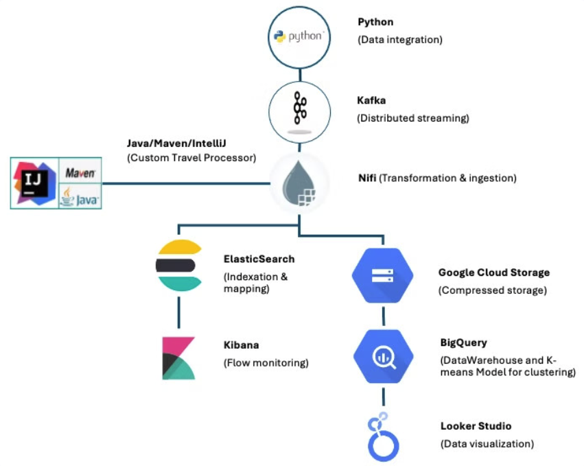
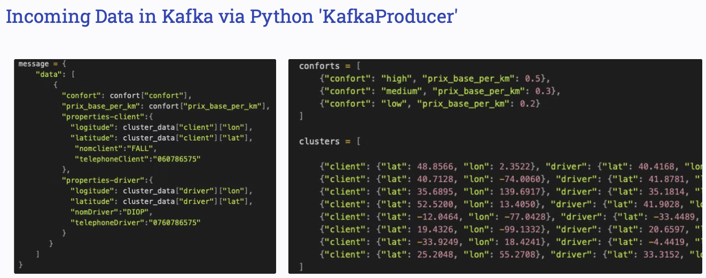
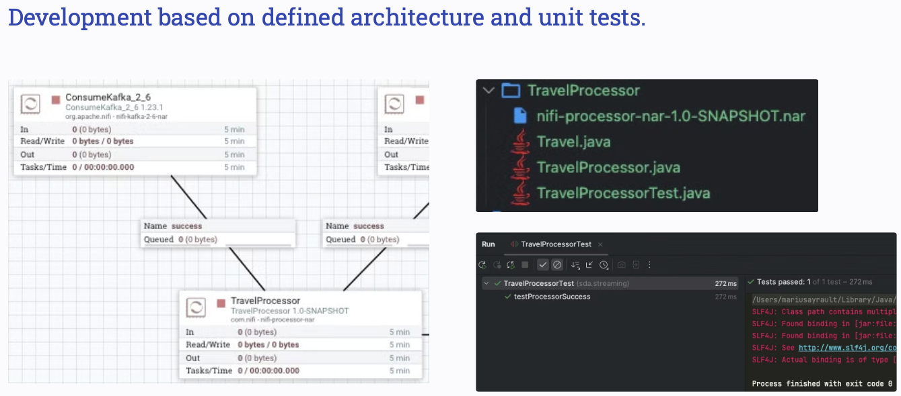
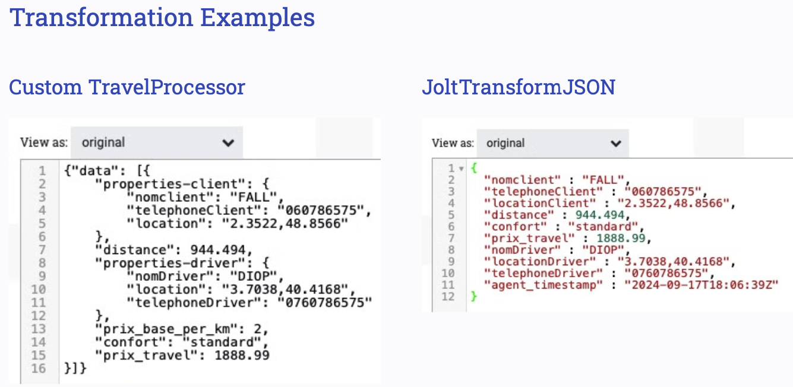
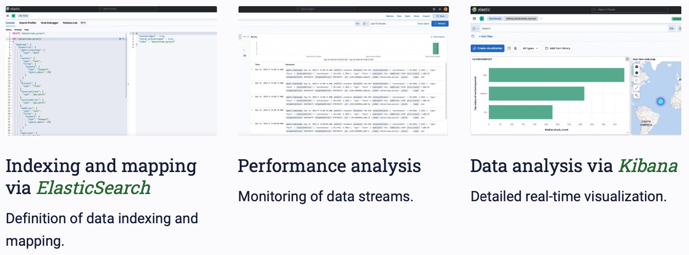
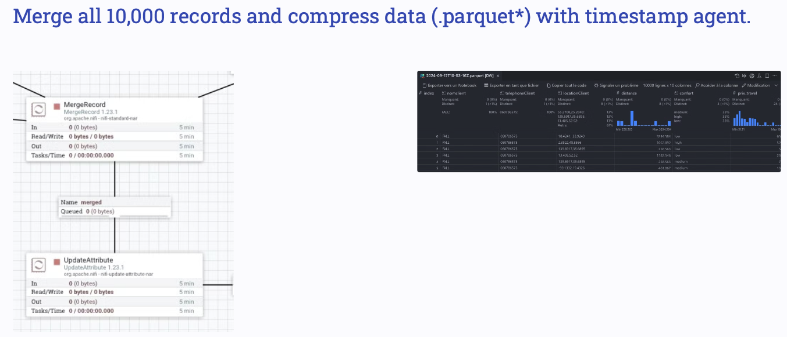
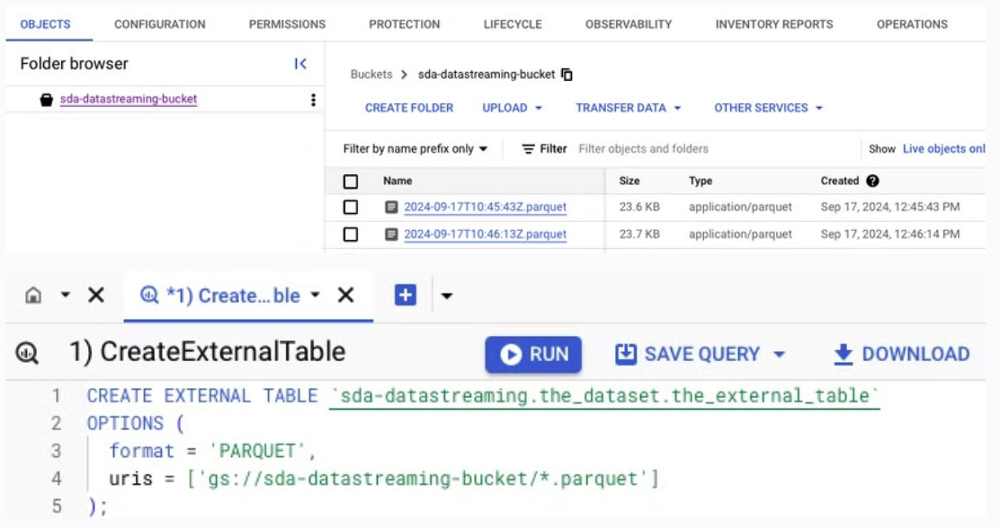
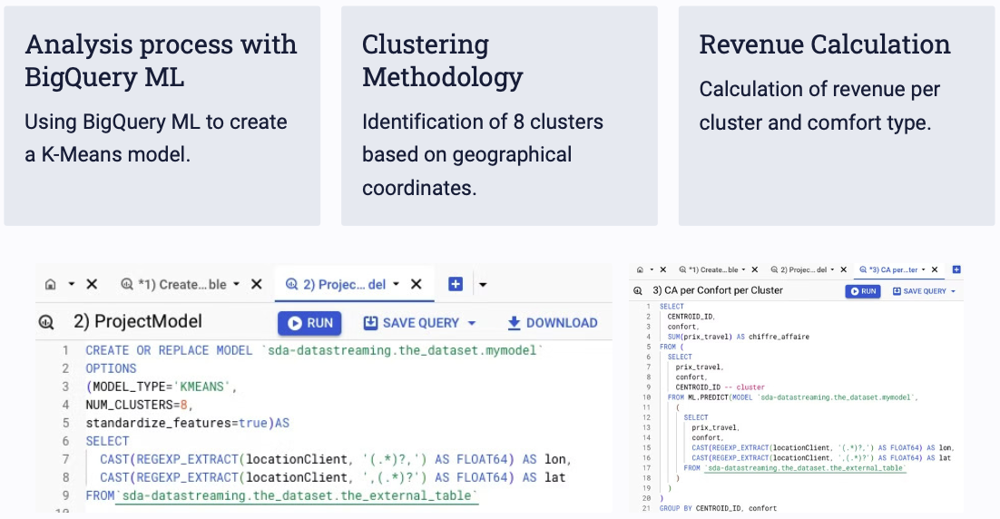
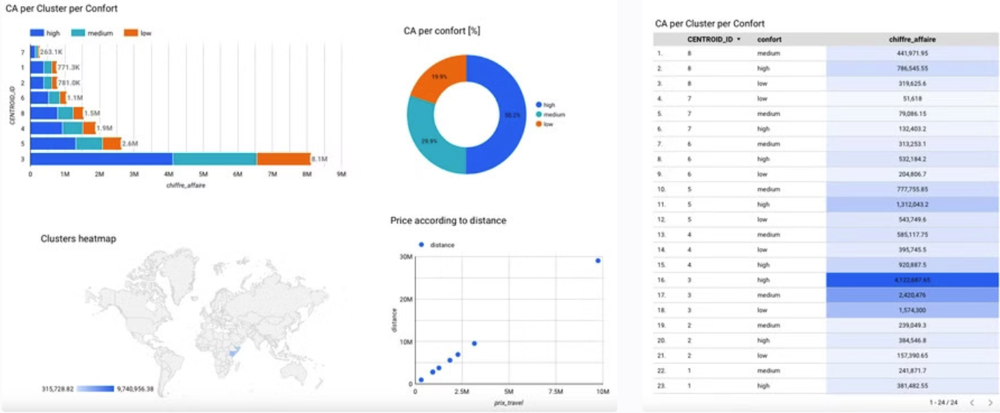

# DATASTREAM - Real-time Taxi Fare Calculation Platform

## Overview
This project developed in a learning context consisted of develop back-end platform designed to calculate taxi fares in real time based on selected comfort levels. This project leverages Kafka for streaming data, ElasticSearch for indexing and monitoring, and Google BigQuery for revenue analysis and clustering. The platform computes fares by analyzing the distance between drivers and customers, grouped by comfort level and geographic clusters.

## Table of Contents
1. [Introduction](#introduction)
2. [Data Model](#data-model)
3. [TravelProcessor Development](#travelprocessor-development)
4. [Data Transformation](#data-transformation)
5. [Indexing & Monitoring](#indexing--monitoring)
6. [Data Warehouse and BigQuery](#data-warehouse-and-bigquery)
7. [Revenue Calculation by Cluster and Comfort Level](#revenue-calculation-by-cluster-and-comfort-level)
8. [Data Visualization](#data-visualization)

---

## Introduction
This project aims to provide an accurate fare calculation for taxi trips by estimating the distance between drivers and customers. Fare determination takes into account the selected level of comfort for each trip.

## Data Model
Incoming data is processed in real-time via Kafka, using Python's `KafkaProducer`. This data includes customer requests, driver availability, and location information.
> Note: Data, including location coordinates (longitude, latitude), is randomly generated, which may result in inconsistent map locations.

## TravelProcessor Development
The `TravelProcessor` module is designed and tested based on a predefined architecture. Unit tests ensure the reliability and accuracy of distance calculations and fare estimations.

## Data Transformation
Custom transformations are applied to the incoming data, with examples of transformations defined in `TravelProcessor` using `JoltTransformJSON`.

## Indexing & Monitoring
The platform uses ElasticSearch for:
- **Indexing & Mapping:** Data indexing and mapping are defined to optimize search and retrieval of fare and distance calculations.
- **Performance Monitoring:** Real-time monitoring of data streams and performance analysis.
- **Data Visualization:** Kibana provides a detailed and real-time visualization of processed data.

## Data Warehouse and BigQuery
All records (10,000+) are consolidated and stored in a data warehouse in `.parquet` format, along with timestamps, using Google BigQuery.

## Revenue Calculation by Cluster and Comfort Level
Revenue calculations are performed using a K-Means clustering model developed with BigQuery ML:
- **Clustering** - Eight clusters are identified based on geographical coordinates.
- **Revenue Analysis** - Revenue per cluster and comfort level is calculated to assist in understanding profitability across different areas and service types.

## Data Visualization
The results from the clustering and revenue calculations are visualized in Looker Studio, providing an insightful view of the model outcomes and revenue distributions.

